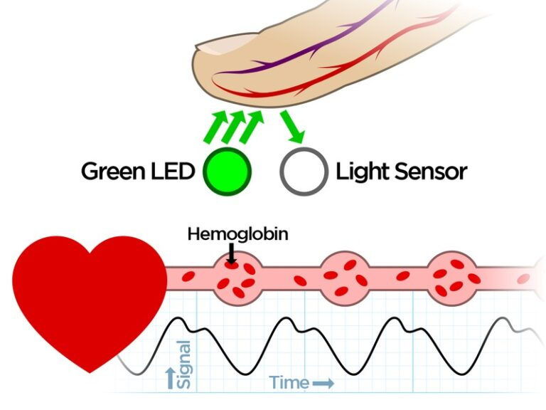
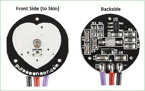
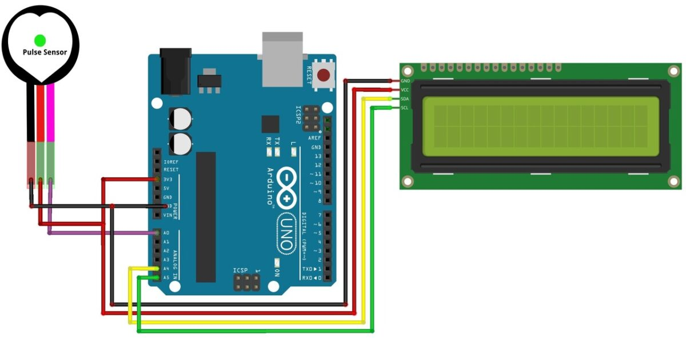

# Health Monitoring System (Heart Rate Monitor)

A simple heart rate monitor built with an Arduino Uno, a pulse sensor and a 16x2 I2C LCD. When you rest a fingertip on the sensor, the Arduino detects each heartbeat and shows the beats per minute (BPM) on the display and in the Serial Monitor.

> **Status:** Working prototype
> **Note:** This is an educational project. It is not a medical device and must not be used for diagnosis.

## Demo

<!-- Add a photo of your own build here:  -->

## Components

| Component | Qty | Purpose |
|---|---|---|
| Arduino Uno | 1 | Main controller |
| Pulse sensor (analog) | 1 | Detects the pulse through the fingertip |
| 16x2 LCD with I2C backpack | 1 | Displays the heart rate |
| Jumper wires, USB cable | - | Connections and power |

## How the pulse sensor works

The sensor uses photoplethysmography (PPG). A green LED shines light into the fingertip and a light sensor measures how much comes back. Each heartbeat pushes blood through the finger and changes the amount of light absorbed, which gives a signal that rises and falls with the pulse.

The sensor has three pins: signal, power and ground.

## Circuit

| Arduino Uno pin | Connected to |
|---|---|
| A0 | Pulse sensor signal |
| 3.3 V (or 5 V) | Pulse sensor VCC |
| GND | Pulse sensor GND and LCD GND |
| 5V | LCD VCC |
| A4 (SDA) | LCD SDA |
| A5 (SCL) | LCD SCL |

The LCD uses the standard I2C pins of the Uno, with the address `0x27` set in the code. If your display stays blank, check the address with an I2C scanner sketch, since some modules use `0x3F`.

## How the code works

1. The sensor output goes to analog pin A0.
2. The PulseSensor Playground library samples the signal in the background and marks a beat each time it rises above the threshold, which is set to `550` in the code.
3. On every detected beat, the code reads the current BPM, prints it to the Serial Monitor, and shows it on the second line of the LCD under the "Heart Rate" label.
4. The on-board LED on pin 13 blinks with each beat.

## Code

The full sketch is in [`code/code.ino`](code/code.ino).

Libraries needed (install from **Sketch → Include Library → Manage Libraries**):

- PulseSensor Playground
- LiquidCrystal I2C

To run it:

1. Open the file in the Arduino IDE and install the two libraries.
2. Select **Board: Arduino Uno** and the correct port.
3. Upload.
4. Rest a fingertip gently on the sensor. Do not press hard, because that cuts off blood flow and the reading becomes unstable.
5. Open the Serial Monitor at 9600 baud to see each beat and the BPM.

## Limitations

- The reading takes a few beats to settle after you place your finger on the sensor.
- The `550` threshold may need adjusting for different fingers, lighting and sensor placement.
- Movement and strong ambient light add noise to the signal.

## Possible improvements

- Average several readings to give a steadier BPM
- Add a buzzer or LED alert when the rate goes above or below a set range
- Add a temperature sensor to make it a fuller health monitor
- Send the readings over Wi-Fi with an ESP32 to a phone app or dashboard
